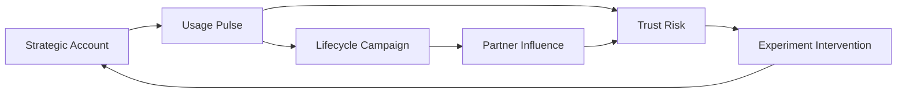

# Customer Intelligence Graph

<p align="center">
  
  
  
  
</p>

## Executive Summary

Customer Intelligence Graph is a recruiter-ready flagship frontend that maps how accounts, lifecycle campaigns, product usage, partner influence, trust risk, and experimentation outcomes compound into real commercial decisions.

Instead of showing one more KPI board, it translates customer intelligence into a relationship surface: nodes, edges, pressure paths, narrative threads, and action-ready insights.

## Recruiter Takeaway

This project shows how I think when a company needs more than a dashboard:

- I turn fragmented growth, revenue, and lifecycle signals into a coherent operating model.
- I design internal products that help leadership understand *why* a commercial outcome is happening, not just *what* changed.
- I build interfaces that connect technology, operations, GTM, and narrative decision-making.

## Overview

| Area | What it shows |
| --- | --- |
| Relationship graph | Connected account, lifecycle, usage, partner, risk, and experiment nodes |
| Narrative threads | Expansion, recovery, and attribution stories derived from linked signals |
| Signal board | Metro-style decision surface for operational and commercial pressure |
| Insight ribbon | Executive-facing summary cards for leverage, decay, confidence, and readiness |

## Why This Exists

Most growth and revenue teams can see events. Fewer can see relationships.

Customer Intelligence Graph is framed around a simple idea: the most important commercial decisions usually live between systems, not inside any single one. Revenue, lifecycle motion, experimentation, product usage, support drag, and trust signals all shape the customer story, but they are often reviewed in separate dashboards owned by different teams.

This interface compresses those fragments into one connected surface.

## Architecture



Additional implementation notes live in [docs/architecture.md](./docs/architecture.md).

## Screenshots

### Hero


### Relationship Surface


### Narrative Threads


### Signal Board


## Running Locally

```powershell
Set-Location "C:\Users\chaus\dev\repos\customer-intelligence-graph"
npm install
npm run dev
```

## Validation

```powershell
npm test
npm run build
npm run lint
```

## Portfolio Links

- [Kinetic Gain](https://kineticgain.com/)
- [Skills / Portfolio](https://mizcausevic.com/skills/)
- [LinkedIn](https://www.linkedin.com/in/mirzacausevic)
- [Medium](https://medium.com/@mizcausevic)
- [GitHub](https://github.com/mizcausevic-dev)
