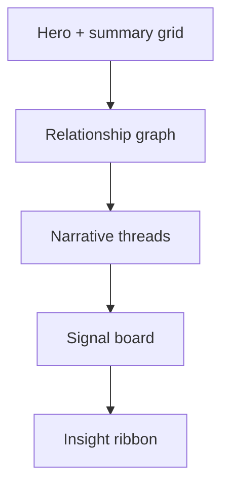

# Customer Intelligence Graph Architecture

## Intent

Customer Intelligence Graph is designed as a visual decision surface rather than a conventional analytics dashboard. The interface treats commercial reality as a set of connected entities and pressure paths:

- accounts
- usage signals
- lifecycle campaigns
- partner influence
- trust or renewal risk
- experimentation interventions

## UI Structure

## Why Graph-First

The point of the graph is not novelty. It is decision clarity.

When teams review isolated KPIs, they usually miss how one motion compounds into another. A graph-first surface makes cross-system relationships visible:

- a usage change can precede renewal pressure
- a campaign response can alter channel influence
- a pricing experiment can reshape account quality
- a support or trust issue can suppress expansion probability

## Design Direction

This build intentionally avoids default SaaS dashboard aesthetics. It uses:

- metro-style symmetric tiles
- a dark control-room palette with teal, cyan, amber, lime, and rose accents
- serif-led narrative headlines for stronger editorial contrast
- cleaner spacing and lower visual clutter than generic panel grids

## Repository Layout

- `src/App.tsx`: flagship composition
- `src/data.ts`: graph nodes, edges, summaries, signals, and narrative content
- `src/styles.css`: custom visual system and responsive graph layout
- `src/App.test.tsx`: smoke coverage for key narrative sections
- `screenshots/*.svg`: recruiter-facing static renders for GitHub
